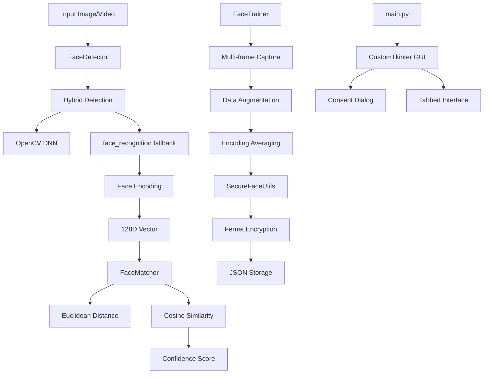

# RecogFace

[](https://opensource.org/licenses/MIT)
[](https://www.python.org/downloads/)
[](https://opencv.org/)

A face recognition system with hybrid detection, encrypted storage, and GUI interface.

### Key Features

- **Hybrid Detection**: OpenCV DNN with face_recognition fallback
- **Encrypted Storage**: Fernet encryption for face data
- **GUI Interface**: CustomTkinter tabs for enrollment and recognition
- **Batch Processing**: Gallery image processing with annotations
- **Age/Gender Estimation**: Optional DeepFace integration

## Architecture



### Core Components

| Component | Purpose | Implementation |
|-----------|---------|----------------|
| `face_detector.py` | Hybrid face detection and encoding | OpenCV DNN + face_recognition fallback |
| `face_trainer.py` | Person enrollment with augmentation | Multi-frame capture, encrypted storage |
| `face_matcher.py` | Face matching against database | Euclidean distance + cosine similarity |
| `utils.py` | Utilities for encryption and logging | Fernet encryption, notifications, DeepFace |
| `main.py` | GUI application | CustomTkinter with tabs and consent dialog |

## Features

- **Hybrid Detection**: OpenCV DNN with face_recognition fallback
- **Encrypted Storage**: Fernet encryption for face database
- **Tabbed GUI**: Enrollment, Live Recognition, Gallery Batch, Settings
- **Consent Dialog**: Privacy agreement required on first launch
- **Batch Processing**: Gallery image processing with match annotations
- **Age/Gender Estimation**: Optional DeepFace integration
- **System Notifications**: Alerts for unknown faces
- **Logging**: Event logging with timestamps

## Quick Start

### Installation

```bash
git clone https://github.com/727aps/RecogFace.git
cd RecogFace
pip install -r requirements.txt
python main.py
```

### Usage

1. Accept privacy consent on first launch
2. Use "Enroll Person" tab to add faces
3. Use "Live Recognition" for webcam detection
4. Use "Gallery Batch" for processing image folders

## Usage Examples

### Enrollment
```python
from src.face_trainer import FaceTrainer

trainer = FaceTrainer()
success = trainer.add_person("John Doe", "JD001")
```

### Recognition
```python
from src.face_matcher import FaceMatcher

matcher = FaceMatcher(tolerance=0.5)
matches = matcher.match_multiple_faces(face_encodings)
```

### Batch Processing
```python
results = matcher.batch_match_gallery(image_paths, output_directory)
```

## Technical Details

### Detection Pipeline
1. OpenCV DNN face detection with face_recognition fallback
2. 128D face encoding extraction
3. Euclidean distance matching with cosine similarity verification
4. Confidence scoring based on distance thresholds

### Storage
- Encrypted JSON database using Fernet encryption
- Face encodings stored as 128D numpy arrays
- Person metadata with quality scores

### GUI Components
- CustomTkinter tabbed interface
- Consent dialog for privacy compliance
- Real-time webcam display with face overlay
- File selection dialogs for batch processing
