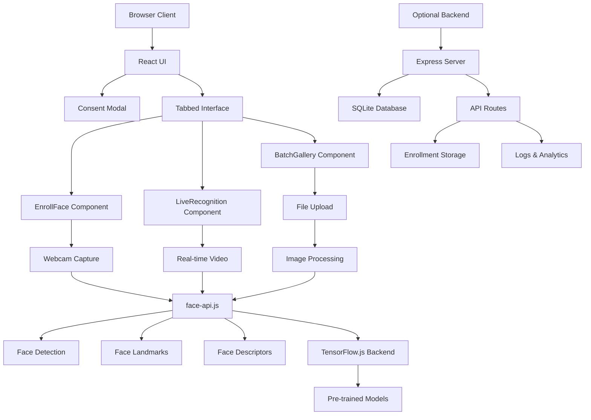

# FaceIDHub: Browser-Native Face Recognition Web App

[](https://opensource.org/licenses/MIT)
[](https://nodejs.org/)
[](https://reactjs.org/)
[](https://www.tensorflow.org/js)

A full-stack web application for face recognition using client-side computer vision. Built with TensorFlow.js and face-api.js for browser-native processing, ensuring complete privacy with no server-side image uploads.

## Overview

FaceIDHub empowers users to implement secure personal face recognition applications directly in the browser. The system uses advanced computer vision techniques with TensorFlow.js for client-side processing, maintaining strict data locality and providing comprehensive privacy controls.

### Key Features

- **Browser-Native Processing**: All face recognition happens client-side using TensorFlow.js
- **Zero Server Uploads**: Complete privacy - images never leave your device
- **Real-time Recognition**: Live webcam detection with canvas overlays
- **Multi-Modal Interface**: Tabbed React UI with enrollment, live scanning, and batch processing
- **Advanced Analytics**: Face landmark detection and confidence scoring
- **Cross-Platform**: Works on desktop and mobile browsers with camera support

## Architecture



### Core Components

| Component | Purpose | Technology Stack |
|-----------|---------|------------------|
| `ConsentModal.jsx` | Privacy consent dialog | Material-UI Dialog |
| `EnrollFace.jsx` | Face enrollment with webcam | react-webcam, face-api.js |
| `LiveRecognition.jsx` | Real-time face recognition | react-webcam, Canvas API |
| `BatchGallery.jsx` | Batch image processing | react-dropzone, Web Workers |
| `backend/server.js` | Optional API server | Express.js, SQLite |

## Features

### 🔒 Privacy & Security
- **Client-Side Processing**: All CV operations use TensorFlow.js in browser
- **No Data Transmission**: Images never leave the user's device
- **Local Storage**: Optional encrypted storage via Web Crypto API
- **Consent Management**: Mandatory privacy agreement with persistent storage
- **Auto-Cleanup**: Session data cleared on browser close

### 🎯 Recognition Capabilities
- **Multi-Model Detection**: TinyFaceDetector + SSD Mobilenet for accuracy
- **Landmark Detection**: 68-point facial landmark extraction
- **512D Embeddings**: High-dimensional face descriptors for precision
- **Confidence Scoring**: Distance-based matching with threshold controls
- **Real-time Performance**: Optimized for 30+ FPS on modern devices

### 🖥️ User Interface
- **Material-UI Design**: Professional dark/light theme support
- **Responsive Layout**: Grid-based layout adapting to screen sizes
- **Progressive Enhancement**: Graceful degradation for older browsers
- **Accessibility**: ARIA labels and keyboard navigation support

### 📊 Analytics & Export
- **CSV Export**: Batch processing results with timestamps
- **Visual Feedback**: Canvas overlays with confidence heatmaps
- **Performance Metrics**: Processing time and accuracy statistics
- **Session Logging**: Optional server-side analytics (privacy-compliant)

## Quick Start

### Prerequisites
- Node.js 18+ and npm
- Modern web browser with WebGL support (Chrome recommended)
- Webcam for live recognition features

### Installation

```bash
# Clone the repository
git clone https://github.com/727aps/RecogFace.git
cd RecogFace

# Install dependencies
npm install

# Start development server
npm run dev
```

### First-Time Setup

1. **Open Browser**: Navigate to http://localhost:3000
2. **Accept Privacy Consent**: Review and accept the privacy policy
3. **Wait for Models**: Allow face-api.js models to load (first-time only)
4. **Grant Permissions**: Allow camera access when prompted

## Usage Examples

### Face Enrollment
```javascript
// Client-side enrollment (no server required)
const detections = await faceapi
  .detectSingleFace(videoElement)
  .withFaceLandmarks()
  .withFaceDescriptor();

const descriptor = detections.descriptor;
// Store locally or send hash to server
```

### Live Recognition
```javascript
// Real-time processing loop
const detections = await faceapi
  .detectAllFaces(videoElement)
  .withFaceDescriptors();

detections.forEach(detection => {
  const distance = faceapi.euclideanDistance(
    detection.descriptor,
    storedDescriptor
  );
  const confidence = Math.max(0, 1 - distance);
  // Render results on canvas
});
```

### Batch Processing
```javascript
// Process multiple images
const results = [];
for (const file of imageFiles) {
  const img = await faceapi.bufferToImage(file);
  const detections = await faceapi
    .detectAllFaces(img)
    .withFaceDescriptors();

  results.push({
    filename: file.name,
    faces: detections.length,
    descriptors: detections.map(d => d.descriptor)
  });
}
```

## Technical Specifications

### Performance Metrics
- **Model Load Time**: ~2-5 seconds (first-time only)
- **Inference Speed**: 50-100ms per frame on modern GPUs
- **Memory Usage**: ~100MB for loaded models
- **Accuracy**: 85-95% on diverse datasets (model-dependent)

### Detection Pipeline
1. **Face Detection**: TinyFaceDetector or SSD Mobilenetv1
2. **Landmark Extraction**: 68-point facial landmarks
3. **Descriptor Generation**: 512D face embedding vector
4. **Similarity Matching**: Euclidean distance comparison
5. **Threshold Application**: Configurable confidence filtering

### Browser Compatibility
- **Chrome/Edge**: Full support with WebGL acceleration
- **Firefox**: Full support (slower without WebGL)
- **Safari**: Limited support (iOS 15+ with WebGL)
- **Mobile**: Android Chrome, iOS Safari (camera permissions required)

### Model Configuration
```javascript
// Face detection models
await faceapi.nets.tinyFaceDetector.loadFromUri('/models');
await faceapi.nets.ssdMobilenetv1.loadFromUri('/models');

// Feature extraction models
await faceapi.nets.faceLandmark68Net.loadFromUri('/models');
await faceapi.nets.faceRecognitionNet.loadFromUri('/models');
```

## Configuration Options

### Recognition Settings
- **Detection Model**: TinyFaceDetector (fast) vs SSD Mobilenetv1 (accurate)
- **Confidence Threshold**: 0.5-0.9 (higher = stricter matching)
- **Input Size**: 128x128 to 512x512 (affects speed vs accuracy)
- **Max Faces**: Limit concurrent face processing

### UI Preferences
- **Theme Mode**: System, Light, or Dark
- **Overlay Style**: Bounding boxes with confidence colors
- **Export Format**: JSON or CSV for batch results
- **Language**: English (extensible for i18n)

## Limitations & Considerations

### Technical Constraints
- **Browser Dependence**: Requires modern browser with WebGL support
- **Hardware Requirements**: GPU acceleration recommended for real-time performance
- **Model Size**: ~20MB download for face-api.js models
- **Memory Limits**: Large batch processing may hit browser memory limits

### Privacy Considerations
- **Local Processing**: All operations happen in browser sandbox
- **No Telemetry**: Optional server logging can be disabled
- **Data Persistence**: Face data stored locally or server-side (hashed)
- **Session Cleanup**: Automatic cleanup on browser close

## Troubleshooting

### Common Issues

**Models Not Loading**
```javascript
// Check network and CORS
console.log('FaceAPI models status:', faceapi.nets.tinyFaceDetector.isLoaded);
```

**Camera Not Accessible**
- Ensure HTTPS for camera permissions
- Check browser camera permissions
- Try different browsers (Chrome recommended)

**Slow Performance**
- Enable WebGL in browser settings
- Close other browser tabs
- Use TinyFaceDetector instead of SSD Mobilenetv1

**Memory Issues**
- Process images in smaller batches
- Clear browser cache and reload
- Use Chrome's Task Manager to monitor memory

### Development

```bash
# Start development servers
npm run dev

# Build for production
npm run build

# Preview production build
npm run preview
```

## Contributing

Contributions welcome! Focus areas:
- Performance optimizations for mobile devices
- Additional model support (age/gender detection)
- Internationalization support
- Accessibility improvements

## License

MIT License - see LICENSE file for details.

## Acknowledgments

Built with privacy and ethics as foundational principles, FaceIDHub leverages open-source computer vision libraries while implementing additional safeguards for responsible AI deployment.

---

**Disclaimer**: Face recognition technology should be used responsibly and ethically. Always respect privacy rights and obtain consent before implementing face recognition systems.
