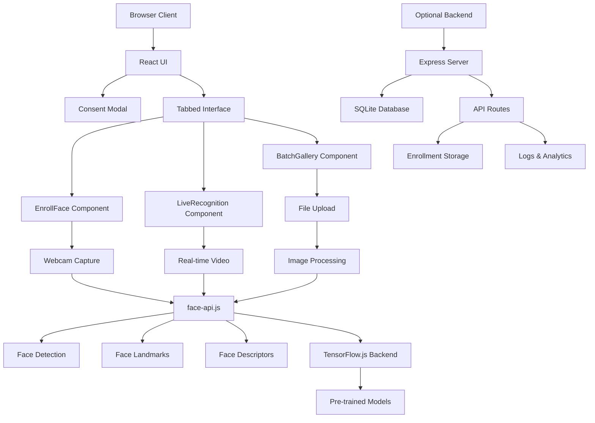

# RecogFace

[](https://opensource.org/licenses/MIT)
[](https://nodejs.org/)
[](https://reactjs.org/)
[](https://www.tensorflow.org/js)

A full-stack web application for face recognition using client-side computer vision. Built with TensorFlow.js and face-api.js for browser-native processing, ensuring complete privacy with no server-side image uploads.

## Overview

FaceIDHub empowers users to implement secure personal face recognition applications directly in the browser. The system uses advanced computer vision techniques with TensorFlow.js for client-side processing, maintaining strict data locality and providing comprehensive privacy controls.

### Key Features

- **Browser-Native Processing**: All face recognition happens client-side using TensorFlow.js
- **Zero Server Uploads**: Complete privacy - images never leave your device
- **Real-time Recognition**: Live webcam detection with canvas overlays
- **Multi-Modal Interface**: Tabbed React UI with enrollment, live scanning, and batch processing
- **Advanced Analytics**: Face landmark detection and confidence scoring
- **Cross-Platform**: Works on desktop and mobile browsers with camera support

## Architecture



### Core Components

| Component | Purpose | Technology Stack |
|-----------|---------|------------------|
| `ConsentModal.jsx` | Privacy consent dialog | Material-UI Dialog |
| `EnrollFace.jsx` | Face enrollment with webcam | react-webcam, face-api.js |
| `LiveRecognition.jsx` | Real-time face recognition | react-webcam, Canvas API |
| `BatchGallery.jsx` | Batch image processing | react-dropzone, Web Workers |
| `backend/server.js` | Optional API server | Express.js, SQLite |

## Features

### 🔒 Privacy & Security
- **Client-Side Processing**: All CV operations use TensorFlow.js in browser
- **No Data Transmission**: Images never leave the user's device
- **Local Storage**: Optional encrypted storage via Web Crypto API
- **Consent Management**: Mandatory privacy agreement with persistent storage
- **Auto-Cleanup**: Session data cleared on browser close

### 🎯 Recognition Capabilities
- **Multi-Model Detection**: TinyFaceDetector + SSD Mobilenet for accuracy
- **Landmark Detection**: 68-point facial landmark extraction
- **512D Embeddings**: High-dimensional face descriptors for precision
- **Confidence Scoring**: Distance-based matching with threshold controls
- **Real-time Performance**: Optimized for 30+ FPS on modern devices

### 🖥️ User Interface
- **Material-UI Design**: Professional dark/light theme support
- **Responsive Layout**: Grid-based layout adapting to screen sizes
- **Progressive Enhancement**: Graceful degradation for older browsers
- **Accessibility**: ARIA labels and keyboard navigation support

### 📊 Analytics & Export
- **CSV Export**: Batch processing results with timestamps
- **Visual Feedback**: Canvas overlays with confidence heatmaps
- **Performance Metrics**: Processing time and accuracy statistics
- **Session Logging**: Optional server-side analytics (privacy-compliant)

## Quick Start

### Prerequisites
- Node.js 18+ and npm
- Modern web browser with WebGL support (Chrome recommended)
- Webcam for live recognition features

### Installation

```bash
# Clone the repository
git clone https://github.com/727aps/RecogFace.git
cd RecogFace

# Install dependencies
npm install

# Start development server
npm run dev
```

### First-Time Setup

1. **Open Browser**: Navigate to http://localhost:3000
2. **Accept Privacy Consent**: Review and accept the privacy policy
3. **Wait for Models**: Allow face-api.js models to load (first-time only)
4. **Grant Permissions**: Allow camera access when prompted
